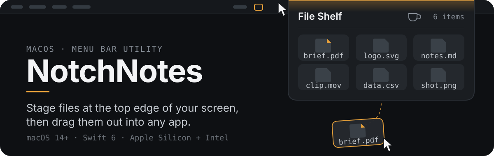
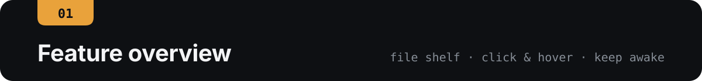
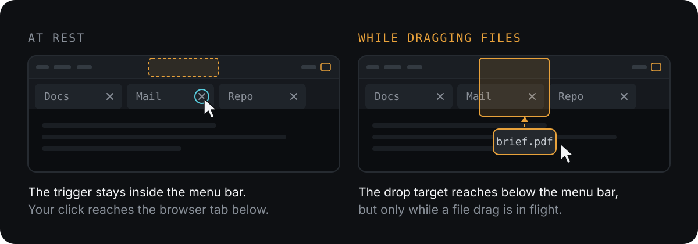
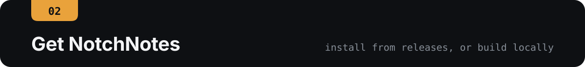
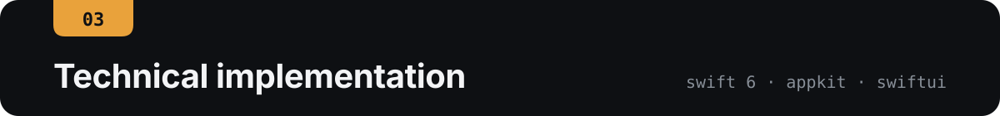

<p align="center">
  
</p>

<p align="center">
  English | <a href="./README.zh-CN.md">简体中文</a>
</p>

<p align="center">
  
  
  
</p>

<p align="center">
  <a href="#feature-overview">Feature overview</a>
  ·
  <a href="#get-notchnotes"><strong>Download and install</strong></a>
  ·
  <a href="https://github.com/oil-oil/NotchNotes">Upstream project</a>
</p>

<p align="center">
  
</p>

## Feature overview

| File staging | Mission Control friendly | Bounded Keep Awake |
| --- | --- | --- |
| Stores path references only; original files stay in place | Hides the Shelf and pauses Hover while you manage windows and Spaces | One click on the menu bar icon prevents idle sleep; a timer beside the notch shows how long, and it turns off when you close the lid or choose Sleep |

### File Shelf

- Drag files or folders to the top of the screen, or add them with `Add Files` or <kbd>⌘</kbd> + <kbd>O</kbd>.
- Select one or multiple items, marquee-select, and drag items out of the Shelf; double-click to open or right-click to reveal in Finder.
- The Shelf stores path references only. It never copies, moves, or deletes the originals, and clearing the Shelf does not delete anything from disk.
- If a referenced file or folder is moved, trashed, or deleted, the Shelf dims it and shows a warning when it next opens, becomes active, or you try to drag it. It does not search for the item’s new location.
- Shelf history stays on your Mac and holds up to 100 items.

### Click / Hover — available when you need it

Choose `Open Shelf With` from the gear in the top-right corner of the Shelf, or right-click the menu bar icon:

- **Hover**: Move the pointer to the top center of the screen to expand the Shelf. Best for Macs with a physical notch.
- **Click**: Click the top center of the screen to expand the Shelf. Best for Macs without a physical notch or anyone who prefers an explicit action.

On first launch, NotchNotes chooses a default based on the display type. Your selection is then stored locally. Hover behavior stays consistent across regular desktops, different Spaces, and full-screen apps.

The trigger area stays inside the menu bar, so it never covers the window below. Clicks that land just under the menu bar — a browser tab’s close button, a toolbar control — still reach the app you are using. The area reaches further down only while you are dragging files, which gives Finder a drop target the pointer can actually enter.

<p align="center">
  
</p>

> [!TIP]
> When you enter Mission Control with a three-finger swipe, <kbd>F3</kbd>, or another system action, the Shelf hides automatically and Hover pauses. Closing or switching Spaces near the top of the screen will not open the Shelf. After leaving Mission Control, move the pointer away from the top area and back again after a short cooldown. This requires no Accessibility permission and does not monitor or intercept trackpad gestures.

### Keep Awake — stops when sleep begins

Click the menu bar tray icon, or the coffee cup in the top-right corner of the Shelf. NotchNotes runs the following command in the background:

```bash
/usr/bin/caffeinate -di -w <NotchNotes PID>
```

- **Menu bar icon**: The tray icon is outlined while Keep Awake is off and filled while it is on. Each time the state changes, a coffee cup briefly takes its place: it bounces in when Keep Awake turns on and drops away when it turns off. The icon returns to the outline as soon as Keep Awake stops, including when the background `caffeinate` process exits unexpectedly.
- **Timer beside the notch**: At the top of the Shelf, the band beside the notch lights one cell for every 10 minutes Keep Awake has been on and shows the running time, such as `1h 24m`. The cells ripple outward from the notch each time the Shelf opens.
- **Right-click menu**: Right-click or Control-click the menu bar icon for `Keep Mac Awake`, `Open Shelf With`, and `Quit NotchNotes`. Add files from the Shelf itself with `Add Files` or <kbd>⌘</kbd> + <kbd>O</kbd>.

With Reduce Motion turned on in System Settings, the icon and the timer change without animation.

| Action | Keep Awake state |
| --- | --- |
| Click the menu bar icon or coffee cup to enable | Prevents display sleep and idle system sleep |
| Click again or quit NotchNotes | Stops immediately |
| Close the lid or choose Sleep from the Apple menu | Stops before macOS enters system sleep |
| Open the lid or wake the Mac | Remains off and does not resume automatically |

> [!NOTE]
> Keep Awake requires no administrator privileges and does not modify system sleep settings. Automatic shutdown depends on the Mac actually entering system sleep. If you use macOS closed-display mode with power and an external display connected, the Mac may continue running; turn off Keep Awake manually and keep the device well ventilated.

<p align="center">
  
</p>

## Get NotchNotes

### Install from Releases

1. Open [Releases](https://github.com/zhoulinhua0-star/NotchNotes/releases) and download `NotchNotes.zip` from the latest release.
2. Unzip it and drag `NotchNotes.app` into Applications.
3. Open NotchNotes. When macOS says “NotchNotes” Not Opened, click **Done** (not Move to Trash).
4. Open System Settings → Privacy & Security, scroll to Security, click **Open Anyway** next to NotchNotes, and confirm with your password or Touch ID. You only need to do this once per downloaded version.

On macOS 15 and later, right-clicking the app and choosing Open no longer skips this check. If you prefer Terminal, this clears the download flag instead:

```bash
xattr -dr com.apple.quarantine /Applications/NotchNotes.app
```

> [!IMPORTANT]
> If the Releases page does not contain `NotchNotes.zip`, this fork has not completed its first release yet. Build it locally with the steps below, or ask the repository maintainer to run the “Release macOS App” workflow in Actions.

Public builds use ad-hoc signing and are not notarized by Apple, so macOS may show a security warning on first launch. Warning-free distribution requires a Developer ID Application certificate and Apple notarization.

### Build locally

You need macOS 14 or later and Xcode or Command Line Tools with Swift 6 support.

```bash
git clone https://github.com/zhoulinhua0-star/NotchNotes.git
cd NotchNotes
swift test
./Scripts/package-app.sh
open dist.noindex
```

After the build finishes, `dist.noindex` contains:

- `NotchNotes.app`: ready to test or drag into Applications.
- `NotchNotes.zip`: a universal Apple Silicon + Intel app archive.
- `NotchNotes.zip.sha256`: the SHA-256 checksum file.

To sign with a Developer ID and submit for Apple notarization:

```bash
SIGN_IDENTITY="Developer ID Application: Your Name (TEAMID)" \
NOTARY_PROFILE="notary-profile" \
./Scripts/package-app.sh
```

## Everyday use and updates

NotchNotes is a menu bar app and normally does not appear in the Dock. Launch it from Spotlight, Finder’s Applications folder, or Terminal:

```bash
open -a NotchNotes
```

To launch it automatically after login, open System Settings → General → Login Items & Extensions → Open at Login, click `+`, and select `NotchNotes.app`.

The app does not currently include an automatic updater. Before installing a new version, quit NotchNotes, drag the new build into Applications, and choose Replace. A normal replacement does not clear Shelf contents or Click / Hover settings.

## Differences from upstream

This fork is based on [oil-oil/NotchNotes](https://github.com/oil-oil/NotchNotes) and currently focuses on three capabilities:

- A dedicated file shelf with cross-app drag and drop.
- Switchable Click / Hover activation at the top of the screen, with Hover paused automatically in Mission Control.
- Basic sleep prevention powered by `/usr/bin/caffeinate`, toggled with one click on the menu bar icon and timed in the Shelf, which stops before macOS enters system sleep.

The upstream Markdown notes interface is not currently included in this fork’s build. Notes and embedded images stored locally by older versions are not deleted, but the current version does not load or display them.

## Automated releases

After GitHub Actions is enabled, pushes to `main` or manual runs of [`release.yml`](https://github.com/zhoulinhua0-star/NotchNotes/actions/workflows/release.yml) run the tests, build the universal app, and create or update the `latest` release. Pushing a `v*` tag also creates a versioned snapshot. Existing releases are not overwritten if tests or builds fail.

<p align="center">
  
</p>

## Technical implementation

- **Swift + AppKit**: Menu bar app with a click-to-toggle status item and SF Symbols effects, overlay window, screen positioning, drag and drop, and top-edge pointer activation; the activation area is confined to the menu bar band and grows below it only for the duration of a file drag, and system window visibility keeps it isolated from Mission Control.
- **SwiftUI**: File Shelf, selection state, settings menu, coffee-cup control, and the Keep Awake timer beside the notch.
- **UserDefaults**: Stores Shelf path references and the selected trigger mode.
- **`/usr/bin/caffeinate` + `NSWorkspace`**: Provides basic sleep prevention without administrator privileges and stops proactively when macOS sends a sleep notification.
